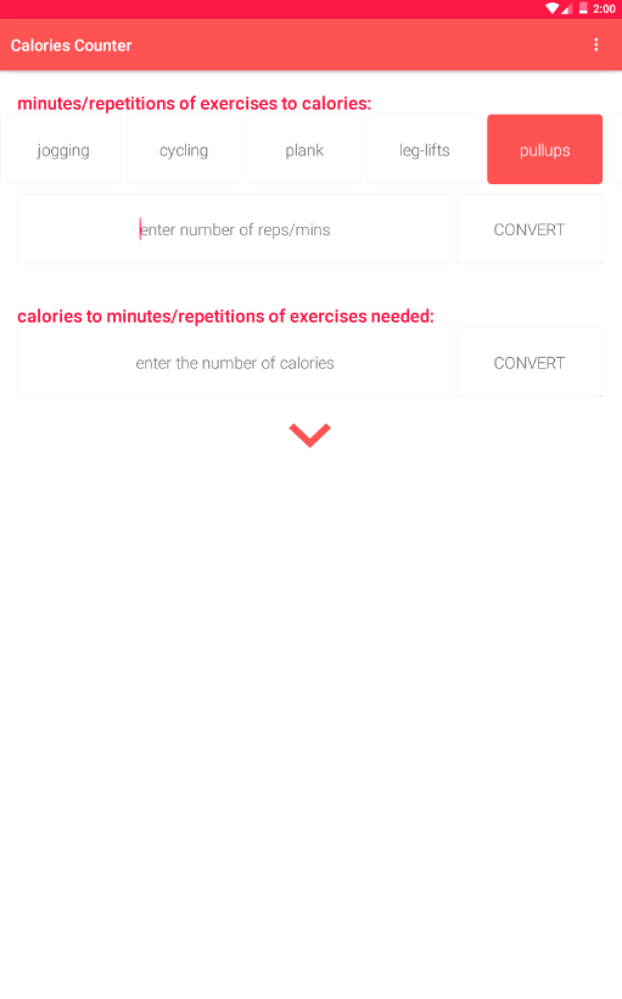
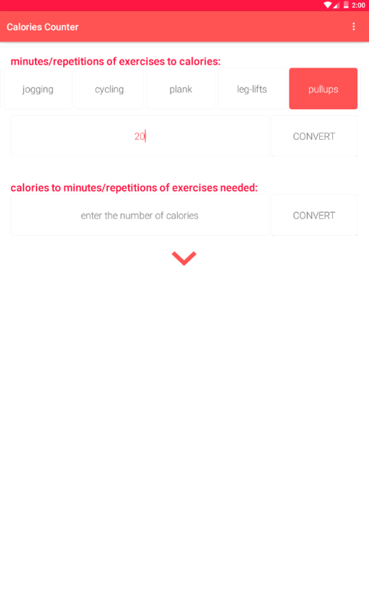
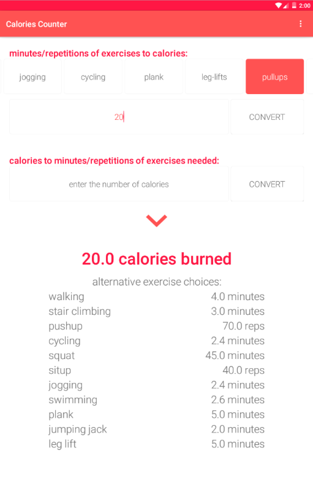
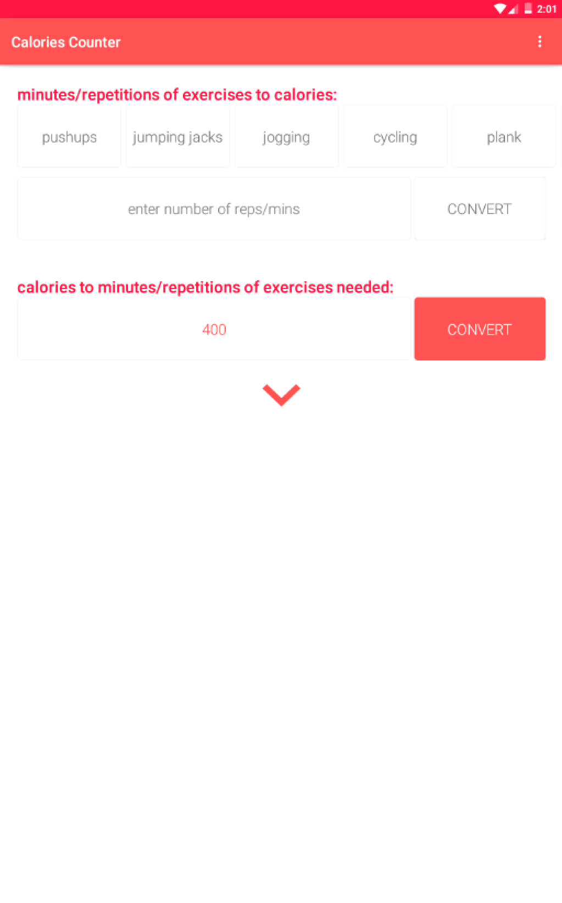
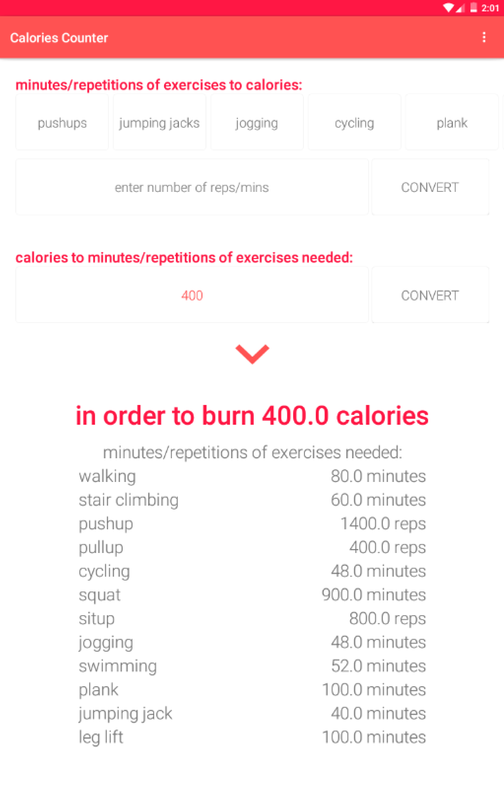

# PROG 01: Crunch Time

Calories Counter is a simple app that converts exercise measurements to calories and vice versa.

## Authors

Unzi Park (unzi.park@berkeley.edu)

## Demo Video

See [https://www.youtube.com/watch?v=MOtRFlktq6c]

## Screenshots

